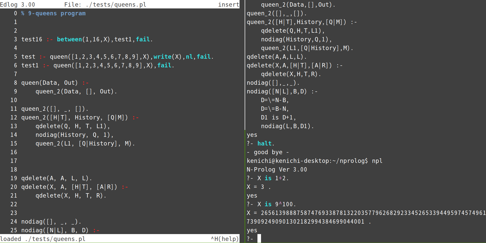
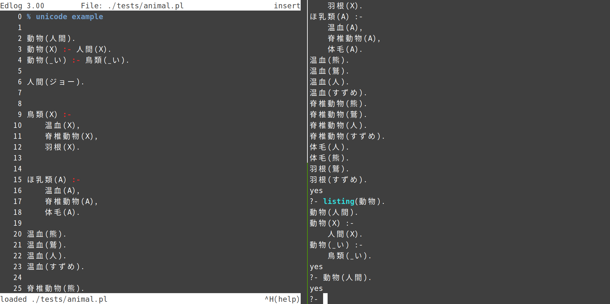

# Edlog
Edlis is a simple editor for ISLisp. Edlis is subset Edwin.



## Invocation
`edit(filename)` in the N-Prolog REPL.

`edlog` or `edlog filename` on terminal.

## Commands

| Key           | Command                 |
| ------------- | ------------------------|
| CTRL+X CTRL+S | Save file               |
| CTRL+X CTRL+C | Quit editor with save   |
| CTRL+X CTRL+I | Insert file             |
| CTRL+X CTRL+Z | Quit editor without save|
| CTRL+X CTRL+W | Save buffer to file     |
| CTRL+X CTRL+L | Save region to file     |

## Editing
The key bindings are a hybrid of Emacs and nano.

| Key       | Binding                         |
| --------- | ------------------------------- |
| Enter     | Automatically indent for Lisp   |
| Insert    | Switch between insert/overwrite |
| Tab       | Insert tab for Lisp             |
| BackSpace | Delete previous char            |
| Delete    | Delete next char                |
| CTRL+F    | Move right                      |
| CTRL+B    | Move left                       |
| CTRL+P    | Move up                         |
| CTRL+N    | Move down                       |
| CTRL+J    | End of line                     |
| CTRL+D    | Delete                          |
| CTRL+H    | Backspace                       |
| CTRL+A    | Beginning of line               |
| CTRL+E    | End of line                     |
| CTRL+V    | Page down                       |
| ESC V     | Page up                         |
| CTRL+K    | Cut selection                   |
| CTRL+U    | Uncut selection                 |
| CTRL+L    | Go to line                      |
| CTRL+S    | Search for word foward          |
| CTRL+R    | Search for word backward        |
| CTRL+T    | Replace word                    |
| ESC TAB   | Complete builtin function or syntax |
| ESC <     | Goto top page                   |
| ESC >     | Goto end page                   |
| ESC f     | Move right in word units        |
| ESC b     | Move left in word units         |
| ESC CTRL+F| Move right in S-exp units       |
| ESC CTRL+B| Move left in S-exp units        |
| ESC CTRL+N| Move right in list units        |
| ESC CTRL+P| Move left in list units         |
| ESC CTRL+U| Move up in list structure       |
| ESC CTRL+D| Move down in list structure     |
| ESC ^     | Mark (or unmark) row for selection. "ESC ^" marks the current row, then cursor up or down selects rows. "ESC ^" again unmarks.|
| ←　→　↑　↓　| Usual cursor movement          |
| Home      | Display top page                |
| End       | Display end page                |
| PageUp    | Page up                         |
| PageDown  | Page down                       |


## Note
Edlog supports Unicode.


# Tmux
Using tmux is very convenient. Pressing CTRL+B followed by % will split the screen into two panes. You can start Edlog on the left side and N-Prolog on the right side. When you want to finish, detach by pressing CTRL+B followed by D in the terminal. To reattach, use tmux attach. The previous state will be restored.


To easily move between the two split screens, add the following setting to the ~/.tmux.conf file:
`set -g mouse on`

# Spec 

- main buffer  row-size  5000, col-size 256 (defined in edlis.h)
- sub buffer  row-size 1000, col-size 256 (defined in edlis.h)

# Hint to modify
The structure of the buffer is extremely simple. Each line consists of 256 characters and is initially initialized to 0. The line ends with an EOL character. The remaining part is left unused. Although there is a lot of waste, the simple structure makes it easy to understand.

The color specification for syntax highlighting is described around line 60 in edlis.c. The curses library allows for 16 color settings. By modifying this part, you can change it to your desired colors.

```
const enum Color ed_syntax_color = RED_ON_DFL;
const enum Color ed_builtin_color = CYAN_ON_DFL;
const enum Color ed_extended_color = MAGENTA_ON_DFL;
const enum Color ed_string_color = YELLOW_ON_DFL;
const enum Color ed_comment_color = BLUE_ON_DFL;

```

 Parentheses highlighting is handled by emphasis_lparen() & emphasis_rparen(). If you change the color settings here, you can modify the color used for bracket highlighting.

 ```
CHECK(addch, ')');
ESCBORG();
if (pos.row >= ed_start) {
ESCMOVE(pos.row + TOP_MARGIN - ed_start,
pos.col + LEFT_MARGIN);
ESCBCYAN();   <----- -------------- color
CHECK(addch, '(');
 ```

 When the Enter key is pressed, tabs are automatically calculated, and spaces are inserted. The tab settings are handled by calc_tab(). By changing the constants here, you can adjust them to your preference.

 ```
 int calc_tabs()
{
    struct position pos;

    if (ed_row == 0 && ed_col == 0)
	return (0);

    pos = find_lparen(0);

    if (ed_data[ed_row][ed_col] == '(')
	return (0);

    if (pos.row == -1)
	return (0);		// can't find left paren

    if (is_special(pos.row, pos.col + 1))
	return (pos.col + 4);
    else
	return (findnext(pos.row, pos.col + 1));

    return (0);			// dummy
}

 ```