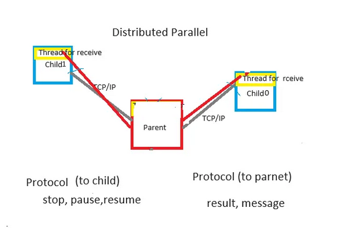
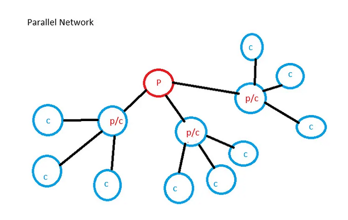

# Distributed Parallel
This is a distributed parallel extension for N-Prolog. N-Prolog is oriented toward computational experiments and aims to explore the potential of Prolog in medium-scale distributed parallel computation.



# Invoke

npl -n on child machine terminal. N-Prolog runs with network mode.

N-Prolog on parent machine terminal. and dp_create/1 to establish TCP/IP between child Prolog.

# Spec

    npl -n: Launches child Prolog in network mode with the -n option.
    A child can also function as a parent. By including dp_create/1 in startup.pl, communication with the child is established immediately after starting in network mode using npl -n. With this functionality, the parent can delegate computations to a grandchild via the child.

    dp_create([IP0,IP1, …,IPn]): Provides IP addresse of child machines to establish TCP/IP communication with the parent Lisp. IP addresse is provided as atom. e.g. '178.1.166.2'
    Up to 100 child devices can be connected.

    dp-and([p0,p1, ...,pn]): It executes the predicates from P0 to PN in parallel. If all of them return YES, it returns YES. If even one returns NO, it returns NO.

    dp_or([p0,p1, ...,n]): It executes the predicates from P0 to PN in parallel. If any one of them returns YES, it interrupts the other computations and returns YES.

    dp_transfer(Fn): Transfers file Fn to all child machines from the parent machine.

    dp_compile(Fn): Compiles file Fn on both parent and child machines.

    dp_consult(Fn): Loads file Fn on both parent and child machines.
    (Note) Internally, reconsult/1 is used. Existing predicates will be overwritten.

    dp_prove(Nth,Pred): Prove Predicate on the Nth child Prolog for testing.

    dp_report(Str): Display String on parent terminal.
    e.g. dp_report($Hello World$').
         string_term(X,1+2),dp_repoert(X).

    dp_close: Sends termination command to child machines and closes communication.
    (Note) If halt is executed without performing dp_close, an error will occur. To terminate properly, dp_close is required.

    dp_parent: When the system is operating as a parent, it returns YES; otherwise, it returns NO. Even if it is a child, it will return YES if it also functions as a parent with its own children.

# Example

```
qsort([], []). 
qsort([Pivot|Tail], Sorted) :-
    partition(Pivot, Tail, Left, Right),
    dp_and([qsort(Left, LeftSorted),qsort(Right, RightSorted)]),   
    append(LeftSorted, [Pivot|RightSorted], Sorted). 

?- dp_create(['178.1.166.1','178.1.166.2']).
?- dp_transfer('./tests/qsort.pl').
?- dp_compile('./tests/qsort.pl').
?- dp_consult('./tests/qsort.o').
?- qsort([2,3,1],X).
 X = [1,2,3] 

?- dp_close.
```

The aforementioned qsort example is intended to illustrate the mechanism, not as a practical example, because the overhead is large compared to the small computational cost. The use case for dp_and/1 is better suited for larger, time-consuming computations that can be computed in parallel independently.

The use case for dp_or/1 is when not all computations are necessarily required. For example, it can be used in determining whether a large number is prime or a pseudoprime. If a single prime factor is found, it is immediately clear that the number is composite, and the remaining computations are unnecessary. This is the kind of situation where dp_or/1 is useful.

The parallel functionality provided by N-Prolog is simple and clear. By isolating and executing large, parallelizable computations within the scope of Prolog's syntax, it aims to dramatically increase the computational capacity of Prolog.

# Protocol
The parent process converts predicates into strings and sends them via TCP/IP communication to the child process. The child process converts the strings back into predicates and attempts to prove them. During this process, variable names are renamed. In the parent process, intermediate calculation variables are represented as v_1, for example. By interpreting these as uppercase V_1, they can be handled as standard variables in Prolog.

At the end of the proof, the child process returns the result as a conjunction or predicate. In the case of success, it returns the unification information of the variables along with the final result true as a conjunction. For example, V_1=2,true. is returned. In the case of failure, it returns fail. These results are sent back to the parent process as strings. The parent process converts these strings back into predicates and transforms the variable V1 into v_1 or the original intermediate variable. By processing this as a proof sequence, the parent process performs unification for the intermediate variables.

In N-Prolog, the predicate ask/0, which is used internally, is appended at the end of the proof sequence. When the child process is operating in network mode, it modifies the behavior of ask/0. Specifically, it converts the unification information of variables and the proof result into a conjunction. For example, it generates V1=2,true.. The child process then further converts this into a string and sends it to the parent process via TCP/IP.

The child process can receive instructions from the parent process via a thread during the proof process. The commands are as follows: 0x11 for stop, 0x12 for pause, and 0x13 for resume. When the child process starts in network mode, it initializes this thread in advance.

The parent process sends the atom 'dp_close' to each child process to terminate the network mode.

Communication between the parent and child processes is conducted via a buffer called bridge. Predicates are converted into strings and transmitted over TCP/IP. The receiving side converts these strings back into predicates and executes them. The functionality of string_term/2 is utilized for this purpose.

The child process sends the control code 0x15 to the parent process if an error occurs. Upon receiving this code, the parent process displays that an error has occurred in the nth child process and triggers the error handling mechanism. The child process automatically recovers from the error and waits for further instructions from the parent process in the REPL.

In dp_transfer/1, the control code 0x15 is sent as a signal to indicate the end of file transmission during file transfers. Initially, EOF was used for this purpose, but it was not recognized on Raspberry Pi systems. Therefore, it was decided to switch to using 0x15.

# Error Handling
This section concerns cases where an error occurs on a child device. When a child device encounters an error, it notifies the parent device via TCP/IP communication. Subsequently, the child device recovers from the error and resumes its role as a child in network mode. Upon receiving an error notification from a child device, the parent device triggers a system error and displays which child device encountered the error. Since the communication between the parent and child devices remains intact, the distributed parallel computation continues uninterrupted.

# Internal Implementation
dp_transfer/1 is responsible for sending a file via TCP/IP on the child device while also invoking dp_receive/1 on the child device. This allows the child device to receive the transferred file contents and record them into a file.

When a child device completes its computation and notifies the parent device, it uses dp_countup/1 to report the proof count. The parent device executes this function, adding the proof count to its own. This is used in measure/1 to calculate LIPS (Logical Inferences Per Second).

Note
To enable distributed parallelism in N-Prolog, access to intermediate variables has been made possible. However, this feature is intended for system use and should not be used by users.

Clauses may be executed recursively, and during each recursion, variables are replaced with intermediate variables through alpha conversion. These intermediate variables are represented as v_1, v_2, and so on. While it is possible to unify with these variables in the REPL, doing so can result in incorrect computation outcomes.

When intermediate variables are sent to child devices, they are replaced with standard Prolog variables. For instance, v_1 is converted to uppercase V_1. These are reserved variables within the system, and users should refrain from using them, as doing so will disrupt correct computations.


# Tree-Structured Network
Distributed parallel child devices can be configured in a tree-like structure. A child device can have its own child devices, treating itself as a parent device.



To configure the network, start by launching the lowest-level child devices in network mode. Then, launch the immediate parent device in network mode. Provide the parent device with a file named network.pl. This file is loaded and executed immediately after startup. In this file, include a predicate using dp_create/1 to initialize the child devices.

e.g. network.pl
```
:- dp_create([IP0,IP2,...IPn]).
```
The predicates dp_transfer/1, dp_consult/1, dp_compile/1, and dp_close/0 operate recursively in such a network. Specifically, when these predicates are executed on the top-level parent device, they are first executed on its child devices and then propagated to the grandchild devices. This process continues through all hierarchical levels, ensuring execution across the entire network.

In distributed parallel computing for fluid dynamics, the data structures involved in computation are typically flat. However, much of human knowledge exhibits recursive structures, and intelligent reasoning often follows a depth-first search pattern. To leverage Prolog's logical inference and backtracking capabilities, we adapted a distributed network with a tree-like hierarchical structure. This approach can be applied to scenarios such as lookahead strategies in board games or solving problems like the knight's tour.

# The Era of Parallelism
In modern times, multi-core PCs have become commonplace. In the 20th century, single-core PCs were the norm. Additionally, PCs have become remarkably affordable, with machines like the Raspberry Pi also available. We can confidently say that the era of parallelism has arrived.

In the 20th century, deep learning (DL) had not yet become practical because the machines of the time were too slow for the required computations. Today, with advancements in GPUs, DL has rapidly developed. Similarly, I believe the time has come for symbolic parallel reasoning to finally become practical, thanks to the current environment.